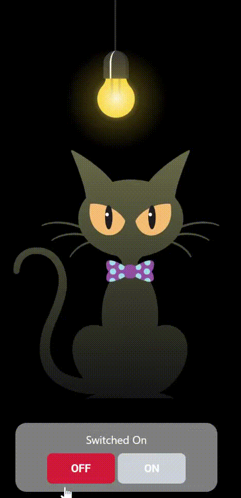

<h1 align="center">💡 Bulb Switch Interaction 🐱</h1>

  <b>An interactive JavaScript project where a bulb and a cat react to ON/OFF switches.</b>

 

<!-- BULB -->
<<<<<<< HEAD
<!-- 

=======

>>>>>>> 42e2730368fd0c67319b772f183eb01f9f18f76a
  

<<<<<<< HEAD
  -->

<!-- CAT -->
<!-- 

=======
 

<!-- CAT -->

>>>>>>> 42e2730368fd0c67319b772f183eb01f9f18f76a
  
<<<<<<< HEAD

 -->
=======

>>>>>>> 42e2730368fd0c67319b772f183eb01f9f18f76a

 

<!-- SWITCH CONTAINER (SAFE) -->
<<<<<<< HEAD
<!-- <table align="center" cellpadding="12"> -->
=======
<table align="center" cellpadding="12">
>>>>>>> 42e2730368fd0c67319b772f183eb01f9f18f76a
  <tr>
    <td align="center" bgcolor="#9ca3af" style="border-radius:16px;">
      

        Switched On
      

      
      
    </td>
  </tr>
</table>
<<<<<<< HEAD
# 🐱 Cat and Lamp Project

A Python project demonstrating interactive behavior between a cat and a lamp.

## 🎬 Output Demo

=======
>>>>>>> 42e2730368fd0c67319b772f183eb01f9f18f76a

 

## ✨ Features

  💡 Bulb ON / OFF toggle  
  🐱 Cat reacts to light  
  🔄 Live status update  
  🎨 Styled using Tailwind CSS

 

## 🛠 Tech Stack

  
  
  

 

  👩‍💻 <b>Amisha Patel</b> 
  <a href="https://github.com/your-username">GitHub</a>

